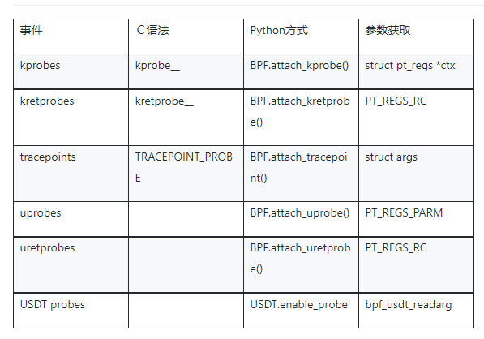

# eBPF Dev Doc

[](https://pkg.go.dev/github.com/cilium/ebpf)


## Intro

eBPF(extended Berkeley Packet Filter) 是一种可以在 Linux 内核中运行用户编写的程序，而不需要修改内核代码或加载内核模块的技术。

eBPF 程序是一个事件驱动模型。Linux 内核提供了各种 hook point，比如 system calls, function entry/exit, kernel tracepoints, network events 等。


我的白话总结： eBpf开发其实是找到对应的内核挂载点，加上自己的采集函数，来获取想要的内核函数的参数或者返回值。


## 重要文档
- ebpf库            
https://github.com/cilium/ebpf
- syscall函数             
https://man7.org/linux/man-pages/man2/syscalls.2.html
- ebpf辅助函数               
https://www.man7.org/linux/man-pages/man7/bpf-helpers.7.html
- bcc参考文档(可为cilium ebpf提供一致的参考)            
https://github.com/iovisor/bcc/blob/master/docs/reference_guide.md
- linux内核自测              
https://elixir.bootlin.com/linux/latest/source/tools/testing/selftests/bpf


## 重要组成
详细参考bcc文档

1. Events & Arguments   
    系统事件
     -  Kprobe/kretprobe  
      ebpf kprobe动态追踪是利用了Kprobes内核调试技术
      主要用来 syscall()函数有无被调用、何时被调用、执行是否正确以及函数的入参和返回值是什么等等
      举例 sys_execve调用次数 通过sys_execve分析cpu占用  
      - Uprobe/uretprobe    
      用户级别的kprobe  
      - Tracepoint  
      出于性能考虑，大部分网络相关的内层函数都是内联或者静态的，两者都不能使用 kprobes 方式探测；
找出调用某个函数的所有地方是相当乏味的，有时所需的字段数据不全具备；
tracepoint 是由内核开发人员在代码中设置的静态 hook 点，具有稳定的 API 接口，不会随着内核版本的变化而变化，可以提高我们内核跟踪程序的可移植性。但是由于 tracepoint 是需要内核研发人员参数编写，因此在内核代码中的数量有限，并不是所有的内核函数中都具有类似的跟踪点，所以从灵活性上不如 kprobes 这种方式。 在我们的内核跟踪程序中，**如果存在 tracepoint 方式，我们应该优先使用**，这使得跟踪程序具有良好的可移植性。

1. Maps   
BPF Map是驻留在内核中的以键/值方式存储的数据结构， 用于用户空间和内核空间之间的数据交换、信息传递。
ps. cilium-ebpf开发中从.c宏函数中传递到golang的业务代码中。  
**根据申请内存方式的不同，BPF Map有很多种类型**  
Map 4要素:  
map_type: Map类型  
key_size: Map键大小  
value_size: Map值的大小  
max_entries: Map的元素最大容量


2. Data
   
   使用辅助函数获取内核函数相关的数据 (pid/tgid等)  
   参照 https://github.com/iovisor/bcc/blob/master/docs/reference_guide.md#data


## 开发步骤

通过./commands (获取系统运行的命令行) 举例

1. 通过需求确定需要附着的事件类型/系统函数 例如使用 `$perf list` 或者 `$perf list 'syscalls:*'` 确认系统函数
2. 可跳过 通过bpftrace确定该系统函数可采集的数据是否符合需求 https://github.com/iovisor/bpftrace
3. 编写.c文件
   ```c
   
    // 4.1 可不写 定义map
    struct {
	  __uint(type, BPF_MAP_TYPE_PERF_EVENT_ARRAY);
	  __uint(key_size, sizeof(u32));
	  __uint(value_size, sizeof(u32));
    } event_map SEC(".maps");

    // 4.2 可不写 定义map传输的struct
    #define FNAME_LEN 32
    struct exec_data_t {
        u32 pid;
        u8 fname[FNAME_LEN];
        u8 comm[FNAME_LEN];
    };


    // 2. 编写 execve_entry_args_t
    struct execve_entry_args_t  {
    };

    // 1. 附着系统函数
    SEC("tracepoint/syscalls/sys_enter_execve")
    // 2. cat /sys/kernel/debug/tracing/events/syscalls/sys_enter_open/format 获取该syscall的参数 编写 execve_entry_args_t   其他事件的参数参照下图
    int enter_execve(struct execve_entry_args_t *args) {

      // 3. 通过辅助函数获取数据 ps
      bpf_get_current_pid_tgid();
      // 打印到 /sys/kernel/debug/tracing/trace 
      bpf_printk("bash: filename: %s", args->filename);
      
      // 4.3 output至用户空间 比bpf_printk有更好的性能
	    bpf_perf_event_output(args, &event_map, BPF_F_CURRENT_CPU, &exec_data, sizeof(exec_data));

    }
   ```
   


4. go generate 编译C文件 生成.o和golang的依赖模块object/map等
5. 编写.go进行业务操作

    ```
    // 参照commands不进行详细解释
    1. 锁定当前进程的ebpf资源的内存
    2. 将预先编译的ebpf程序和maps加载到内核
    3. 调用link.Kprobe/link.Tracepoint等进行attach
    4. 读取map
    ```


## 目前可支持
- 众多ebpf库提供的examples采集皆可通过cilimu-ebpf的写法进行支持

  例如 获取打开文件/获取进程CPU/获取系统函数执行数等

- Kprobe可找到的系统函数相关的指标  
  例如 sys_execve/sys_access/sys_openat/sys_read等等

- Tracepoint支持的1200种系统函数

- https协议抓包
  
## 目前暂未研究

- XDP 相关附着至网络驱动的数据抓取

### 开发难度

   自研ebpf探针主要难度在于对syscall的熟练度， 如果能确定附着的事件类型/系统函数那么开发将会比较顺利
   